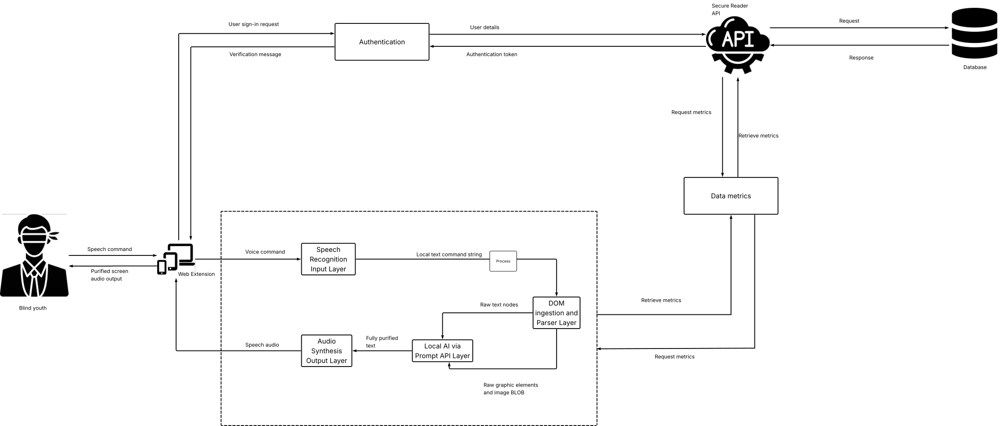
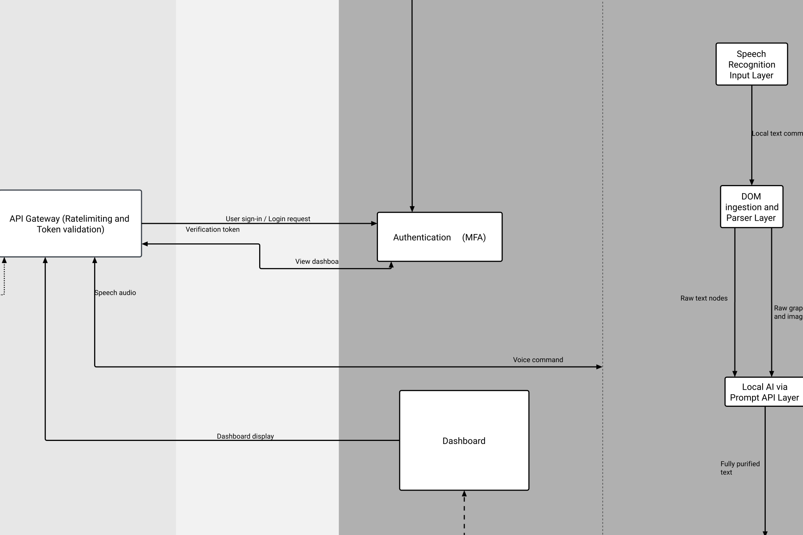

# Architecture

## Architecture reference

The team's formal architecture document is the [SecureReader SAD](https://lucid.app/lucidchart/c82a2e14-a27e-40cd-9c57-6490bf73eae1/edit?invitationId=inv_c3bd121b-0e1f-433d-a1d3-6ac2f1ff2416&page=0_0#).

The SAD can be used for authoritative architecture diagrams and architectural decisions.

---

## Architecture diagram

The authoritative system architecture diagram is maintained in the team's **Software Architecture Document (SAD)**.

The diagram below is the current system architecture diagram used by the team. The documentation site displays the original SVG diagram rather than recreating or redrawing it.

<div class="architecture-diagram">
  
</div>

[Open the SecureReader SAD and architecture diagram](https://lucid.app/lucidchart/c82a2e14-a27e-40cd-9c57-6490bf73eae1/edit?invitationId=inv_c3bd121b-0e1f-433d-a1d3-6ac2f1ff2416&page=0_0#)

> **Diagram source:** Use the SAD as the source of truth for the current architecture diagram and architectural decisions.

---

## Cybersecurity architecture

The cybersecurity architecture describes the security-related components, controls, and relationships within the SecureReader system.

The original cybersecurity SAD is displayed below as an SVG.

<div class="architecture-diagram">
  
</div>

> **Diagram source:** The cybersecurity SAD is the source of truth for the documented cybersecurity architecture and related security decisions.

---

## High-level architecture

SecureReader is composed of several cooperating components, including the browser extension interface, service worker, content scripts, backend API, AI capabilities, and speech functionality.

The main communication paths between these components are described below.

---

## Main communication paths

### Popup to service worker

```
Popup
 -> chrome.runtime.sendMessage()
 -> Service Worker
 -> result
 -> Popup
```

### Service worker to backend

```
Popup
 -> message
 -> Service Worker
 -> fetch()
 -> SecureReader API
 -> response
 -> Service Worker
 -> Popup
```

### Webpage reading

```
Webpage DOM
 -> Content Script
 -> Reader
 -> Cleaned DOM
 -> innerText
 -> Language Detection
 -> Sentence Processing
 -> Speech Synthesis
```

### Image description

```
Webpage
 ->  candidates
 -> Image accessibility checks
 -> LanguageModel.availability()
 -> LanguageModel.create()
 -> Image + Prompt
 -> Gemini Nano
 -> Description
 -> Reading sequence
 -> Speech Synthesis
```

## Why the service worker exists

The popup is a short-lived user interface. The service worker acts as the extension's background coordination layer.

It handles responsibilities including:

- runtime message handling;
- communication with content scripts;
- API requests;
- authentication headers;
- metrics requests.

Manifest V3 uses service workers for extension background logic. Chrome also documents that extension service workers can be terminated when not in use, so persistent state should not depend on worker memory alone.
